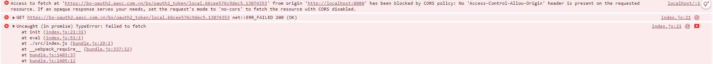
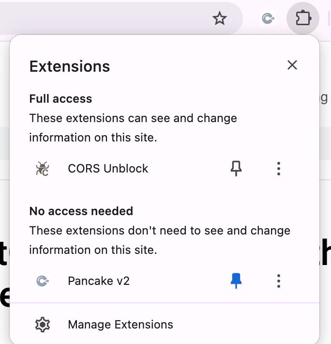
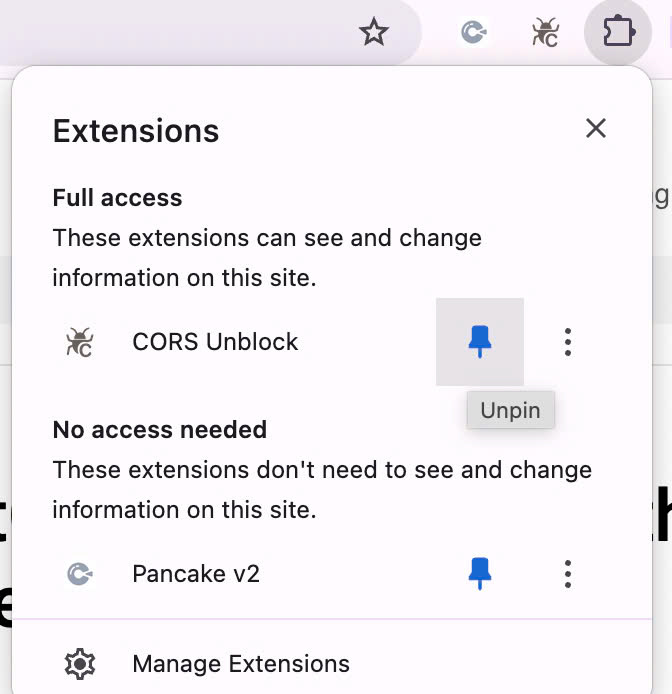

## Cors error

- Trong quá trình xây dựng trang web, em nhận thấy API để lấy access token gặp lỗi CORS.
- Theo tìm hiểu của em thì lỗi này do code phía server, em không rõ đây là chủ ý của đề bài hay do đề bài chưa chính xác. Mặc dù vậy em xin phép coi đây là chủ ý đề bài và xử lý theo hướng không dùng code (đây cũng là cách duy nhất em thấy có thể thực hiện được)
  

## Cors Unblock

Anh/chị vui lòng sử dụng trình duyệt Google Chrome

1. Cài đặt extension Cors Unblock bằng link sau:
   https://chromewebstore.google.com/detail/cors-unblock/lfhmikememgdcahcdlaciloancbhjino?hl=vi

2. Kích hoạt Cors Unblock.

- Nhấn vào kí hiệu extension trên thanh công cụ chrome
  
- Pin Cors Unblock
  
- Click vào logo Cors Unblock để kích hoạt, chữ C sẽ chuyển sang màu cam
  

## Cài đặt

1. Clone repository

```bash
  git clone https://github.com/phvinhquang/aasc-test.git
```

2. Cài đặt dependencies:

```bash
  npm install
```

3. Chạy development server:

```bash
  npm start
```
